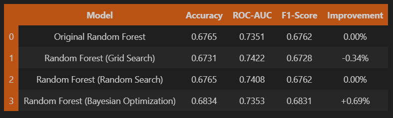
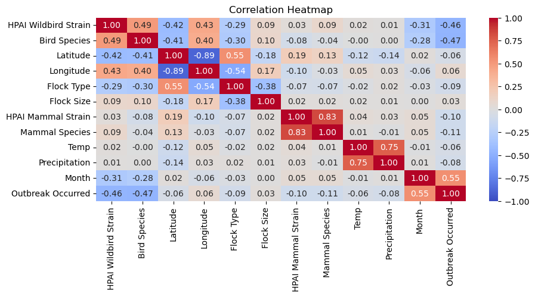
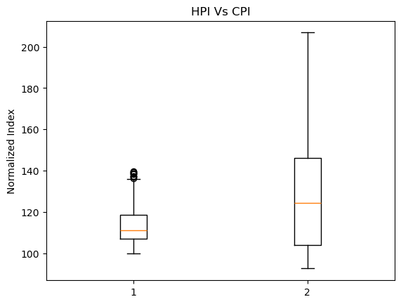

## Selected projects in data Science, machine Learning and deep Learning

### AI powered Lego image classifier  
A CNN based lego image classification model built using Tensorflow / Keras integrating Gradio UI and OpenAI Text-To-Speech for interactive user feedback. 
This project involves data preparation, data pre-processing, data augmentation, model training, model optimization, and model evaluation 

            

#### Image Pre-processing [Resizing, Edge detection, Padding]

#### Image prediction

[View project on Github](https://github.com/maadhuvijay/Project3-Lego-Classifier)

---

### H5N1 Outbreak Risk Classifier

Developed a machine learning model to predict H5N1 bird-flu outbreaks. Team project; my contributions focused on binary classification (Random Forest, Logistic Regression), plus data cleaning, processing, visualization, model training, and hyperparameter tuning.

    

[View project on Github](https://github.com/MaryPulley/Project_2)

---

### Exploratory Analysis of CPI–HPI Trends

Conducted an exploratory data analysis on how inflation relates to housing, unemployment, and the stock market. Led the CPI–HPI track. Cleaned and joined monthly time series, visualized trends and examined outliers. 

    

[View project on Github](https://github.com/xraySMULu/the-big-squeeze)

---
