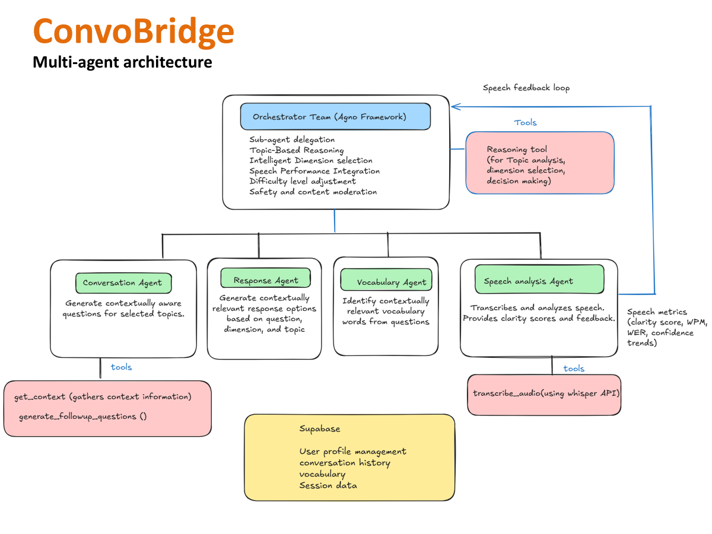
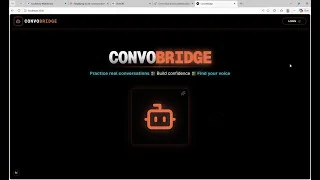
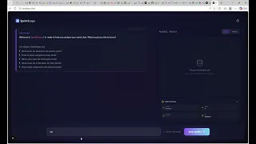
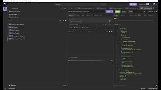
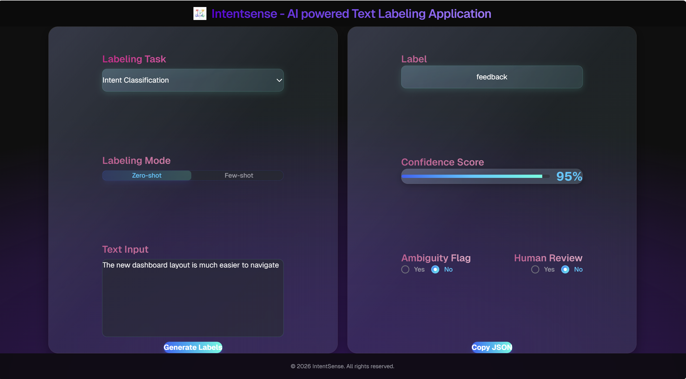
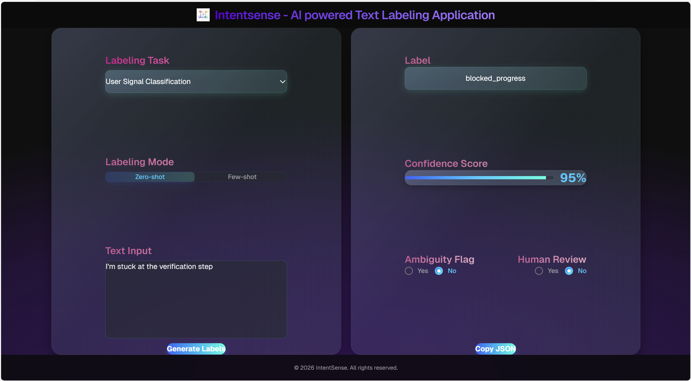
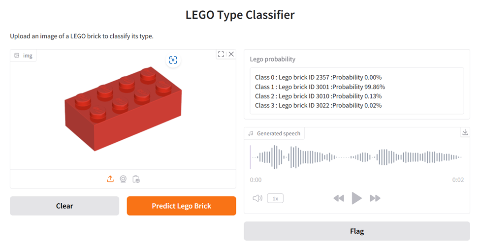
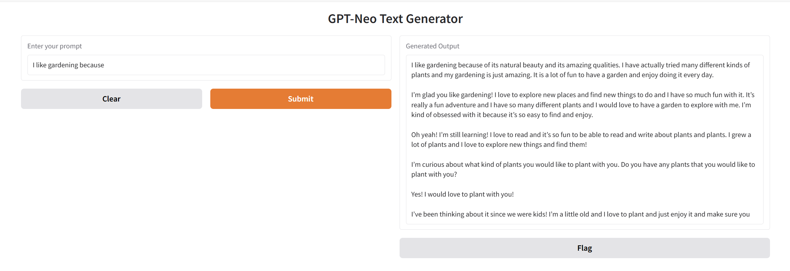

# Featured AI Engineering Projects

## 1. ConvoBridge – A Multi-Agent Conversation Practice Platform for Autistic youth 
ConvoBridge is designed to help individuals with autism learn and navigate conversations at their pace, in their way.
Under the hood, ConvoBridge runs a **multi-agent architecture** built with Agno:

***Orchestrator Agent***    : the brain. It reads the room: how long is the user responding? Are they engaged? How's their speech clarity trending? Based on that, it picks from 9 conversation dimensions (Basic Preferences → Emotional → Reflective → Social Context, etc.) and adjusts sentence difficulty accordingly.

***Conversation Agent***    : generates the actual questions, always following an "Acknowledgement + Personal Preference + Question" format so interactions feel natural, not clinical.

***Response Agent***        : offers 2 topic-specific response options (+ "choose your own") so users never feel stuck staring at a blank screen.

***Vocabulary Agent***      : surfaces a contextually relevant word from each question to quietly build language skills.

***Speech Analysis Agent*** : transcribes responses via Whisper, scores clarity and pace, and feeds that back to the Orchestrator to influence the next question's difficulty.

#### Demo Video 

## 2. SprintScope
This is an AI-powered natural language interface for querying sprint data and track defects using 𝐭𝐨𝐨𝐥 𝐜𝐚𝐥𝐥𝐢𝐧𝐠. It enables users to interact with their database using 𝑐𝑜𝑛𝑣𝑒𝑟𝑠𝑎𝑡𝑖𝑜𝑛𝑎𝑙 𝑞𝑢𝑒𝑟𝑖𝑒𝑠, automatically 𝑔𝑒𝑛𝑒𝑟𝑎𝑡𝑖𝑛𝑔 𝑎𝑛𝑑 𝑒𝑥𝑒𝑐𝑢𝑡𝑖𝑛𝑔 𝐒𝐐𝐋 queries while providing transparent insights into the query process.

𝐂𝐨𝐫𝐞 𝐂𝐚𝐩𝐚𝐛𝐢𝐥𝐢𝐭𝐢𝐞𝐬

𝑵𝒂𝒕𝒖𝒓𝒂𝒍 𝑳𝒂𝒏𝒈𝒖𝒂𝒈𝒆 𝒕𝒐 𝑺𝑸𝑳: Converts user questions into optimized SQL queries

𝑰𝒏𝒕𝒆𝒍𝒍𝒊𝒈𝒆𝒏𝒕 𝑪𝒍𝒂𝒓𝒊𝒇𝒊𝒄𝒂𝒕𝒊𝒐𝒏: Asks for clarification when queries are ambiguous

𝑨𝒖𝒕𝒐𝒎𝒂𝒕𝒊𝒄 𝑺𝑸𝑳 𝑹𝒆𝒑𝒂𝒊𝒓: Self-corrects SQL errors using LLM-powered repair

𝑻𝒓𝒂𝒏𝒔𝒑𝒂𝒓𝒆𝒏𝒕 𝑬𝒙𝒆𝒄𝒖𝒕𝒊𝒐𝒏: Shows generated SQL, results, assumptions, and execution metadata

𝑪𝒐𝒏𝒕𝒆𝒙𝒕-𝑨𝒘𝒂𝒓𝒆 𝑺𝒖𝒈𝒈𝒆𝒔𝒕𝒊𝒐𝒏𝒔: Provides relevant follow-up questions based on query results

#### Demo Video

## 3. Insomnia - Building with Intention

**Insomnia**, is an open-source desktop application and an alternative to **Postman**, where I added new features by first understanding the existing codebase and then applying **_a spec-driven_**, AI-forward approach defining success through specifications, user stories, and acceptance criteria before writing code.

Using this approach, I implemented the following features in Insomnia:

***HTTP Status Code Helper***
 Provides clear, contextual explanations of response codes, reducing the need to look up external documentation.

***Response Time SLA Indicator***
 Adds an immediate performance signal that classifies responses as fast, moderate, or slow.

***Copy Response Summary Action***
 Enables one-click copying of a clean, human-readable response summary for sharing in tickets, chats, or documentation.
 
#### Demo Video

## 4. IntentSense
IntentSense is an AI-powered text labeling interface built to explore how real-world text annotation workflows can be designed using large language models.

The interface follows a two-panel layout that clearly separates human-controlled inputs from model-generated outputs:

### LEFT PANEL
What the user asks the system to do

### RIGHT PANEL
What the model produces and how confident it is

────────────────────────

#### LEFT PANEL: INPUT & CONFIGURATION
The left side represents the Labeling Control Surface everything the user explicitly defines before invoking the model.

1️⃣ Labeling Task  
A dropdown that lets the user choose the type of labeling task:
- Intent Classification  
- Sentiment Analysis  
- User Signal Classification  

**User Signal Classification** is a custom task designed to detect implicit behavioral signals rather than explicit intent or emotional tone, such as:
- implicit_expectation  
- frustration_signal  
- blocked_progress  
- workaround_seeking  

2️⃣ Labeling Mode  
A toggle that allows the user to choose between:
- Zero-shot (no examples provided)  
- Few-shot (static examples included in the prompt)

3️⃣ Text Input  
A multiline text area where the user enters the raw text to be labeled.

### RIGHT PANEL: OUTPUT & REVIEW
The right side represents the Model Response & Evaluation Surface everything produced after inference.

1️⃣ Label Output  
Displays the final predicted label (e.g., neutral).

2️⃣ Confidence Score  
A visual progress bar paired with a numeric confidence value.

3️⃣ Ambiguity Flag  
Indicates whether the input text is considered ambiguous.

4️⃣ Human Review Flag  
Indicates whether the output should be reviewed by a human.  
Low confidence or detected ambiguity automatically triggers review.

5️⃣ Copy JSON  
Allows the user to copy the full structured output for downstream use.

#### Demo Screenshots

## 5. AI powered Lego image classifier  
A CNN based lego image classification model built using Tensorflow / Keras integrating Gradio UI and OpenAI Text-To-Speech for interactive user feedback. 
This project involves data preparation, data pre-processing, data augmentation, model training, model optimization, and model evaluation 

            

### Image Pre-processing [Resizing, Edge detection, Padding]

### Image prediction

### Interactive Gradio Interface

[View project on Github](https://github.com/maadhuvijay/Project3-Lego-Classifier)

---
## 6. NLP Transformer Application Suite – Hugging Face 

Built a complete suite of Natural Language Processing (NLP) applications using state-of-the-art Hugging Face Transformer models.
This project demonstrates a practical understanding of modern transformer-based NLP techniques. Using Python and Hugging Face Transformers, I implemented applications for:

🌍 Language Translation

✨ Text Generation

❓ Question Answering

📝 Text Summarization

      

### Interactive Gradio Interface

